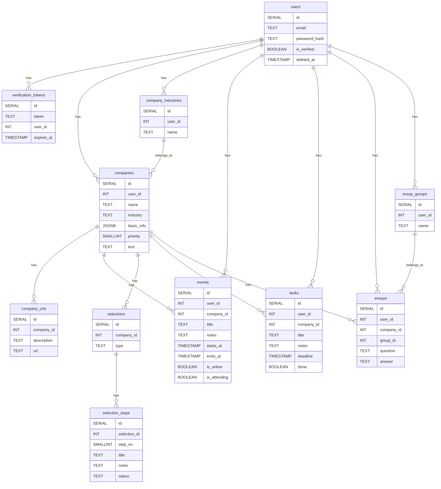

<!-- omit in toc -->
# データベース設計

<!-- omit in toc -->
### テーブル一覧

- [users](#users)
- [verification\_tokens](#verification_tokens)
- [companies](#companies)
- [company\_industries](#company_industries)
- [company\_urls](#company_urls)
- [events](#events)
- [selections](#selections)
- [selection\_steps](#selection_steps)
- [tasks](#tasks)
- [essays](#essays)
- [essay\_groups](#essay_groups)

## users

ユーザー情報

| column         | type         | NULL | description        |
| -------------- | ------------ | ---- | ------------------ |
| id             | SERIAL       | NO   | ユーザーID         |
| email          | TEXT         | NO   | メールアドレス     |
| password_hash  | TEXT         | NO   | パスワードのハッシュ値 |
| is_verified    | BOOLEAN      | NO   | メールアドレス認証の可否 |
| deleted_at     | TIMESTAMP    | YES  | アカウント削除日時 |

- email
  - UNIQUE
- is_verified
  - DEFAULT FALSE
  - TRUEの場合のみログイン可能
  - メールアドレス認証を完了するとTRUEになる
- deleted_at
  - NULLでない場合は論理削除扱い

## verification_tokens

メールアドレスの認証トークン

| column         | type         | NULL | description        |
| -------------- | ------------ | ---- | ------------------ |
| id             | SERIAL       | NO   | ID                 |
| user_id        | INT          | MO   | ユーザーID         |
| token          | TEXT         | NO   | トークン           |
| expires_at     | TIMESTAMP    | NO   | 有効期限           |

- user_id
  - FOREIGN: users.id(ON DELETE CASCADE)
- token
  - UNIQUE
- expires_at
  - トークンの有効期限

## companies

企業情報

| column         | type         | NULL | description        |
| -------------- | ------------ | ---- | ------------------ |
| id             | SERIAL       | NO   | 企業ID             |
| user_id        | INT          | NO   | ユーザーID         |
| name           | TEXT         | NO   | 企業名             |
| industry_id    | INT          | NO   | 業界ID             |
| priority       | SMALLINT     | YES  | 志望度(第1〜5志望) |
| basic_info     | JSONB        | YES  | 基本情報           |
| text           | TEXT         | YES  | 詳細（Markdown）   |

- user_id
  - FOREIGN: users.id(ON DELETE CASCADE)
- industry_id
  - FOREIGN: company_industries.id(ON DELETE RESTRICT)
- priority
  - BETWEEN 1 AND 5
  - NULLの場合、未分類扱い
- UNIQUE (user_id, name)

## company_industries

業界名

| column         | type         | NULL | description        |
| -------------- | ------------ | ---- | ------------------ |
| id             | SERIAL       | NO   | 業界ID             |
| user_id        | INT          | NO   | ユーザーID         |
| name           | TEXT         | NO   | 業界名             |

- user_id
  - FOREIGN: users.id(ON DELETE CASCADE)
- UNIQUE (user_id, name)

## company_urls

企業の関連リンク

| column         | type         | NULL | description        |
| -------------- | ------------ | ---- | ------------------ |
| id             | SERIAL       | NO   | リンクID           |
| company_id     | INT          | NO   | 企業ID             |
| url            | TEXT         | NO   | リンク             |
| description    | TEXT         | NO   | 説明               |

- company_id
  - FOREIGN: companies.id(ON DELETE CASCADE)

## events

説明会等のイベント情報

| column         | type         | NULL | description        |
| -------------- | ------------ | ---- | ------------------ |
| id             | SERIAL       | NO   | イベントID         |
| user_id        | INT          | NO   | ユーザーID         |
| company_id     | INT          | YES  | 企業ID             |
| title          | TEXT         | NO   | イベント名         |
| notes          | TEXT         | YES  | 詳細情報メモ(Markdown)|
| starts_at      | TIMESTAMP    | NO   | 開始日時           |
| ends_at        | TIMESTAMP    | NO   | 終了日時           |
| is_online      | BOOLEAN      | NO   | オンライン／オフライン開催 |
| is_attending   | BOOLEAN      | NO   | 参加／不参加       |

- user_id
  - FOREIGN: users.id(ON DELETE CASCADE)
- company_id
  - FOREIGN: companies.id(ON DELETE CASCADE)
  - NULLの場合、その他（一つの企業に所属しない）
- is_online
  - DEFAULT TRUE
- is_attending
  - DEFAULT TRUE

## selections

選考情報

| column         | type         | NULL | description        |
| -------------- | ------------ | ---- | ------------------ |
| id             | SERIAL       | NO   | 選考ID             |
| company_id     | INT          | NO   | 企業ID             |
| type           | TEXT         | NO   | 種別(本選考、インターンなど) |

- company_id
  - FOREIGN: companies.id(ON DELETE CASCADE)

## selection_steps

選考ステップ情報

| column         | type         | NULL | description        |
| -------------- | ------------ | ---- | ------------------ |
| id             | SERIAL       | NO   | 選考ステップID     |
| selection_id   | INT          | NO   | 選考ID             |
| step_no        | SMALLINT     | NO   | 選考ステップの順序 |
| title          | TEXT         | NO   | 選考ステップ名(一次面接、書類選考など)|
| notes          | TEXT         | YES  | 詳細情報メモ(Markdown)|
| status         | TEXT         | NO   | 選考状況           |

- selection_id
  - FOREIGN: selections.id(ON DELETE CASCADE)
- status
  - pending(未受験または結果待ち) | passed(合格) | failed(不合格)

## tasks

タスクリスト

| column         | type         | NULL | description        |
| -------------- | ------------ | ---- | ------------------ |
| id             | SERIAL       | NO   | タスクID           |
| user_id        | INT          | NO   | ユーザーID         |
| company_id     | INT          | YES  | 企業ID             |
| title          | TEXT         | NO   | タスク概要         |
| details        | TEXT         | YES  | タスク詳細(Markdown)|
| deadline       | TIMESTAMP    | YES  | 期限               |
| done           | BOOLEAN      | NO   | 完了／未完了       |

- user_id
  - FOREIGN: users.id(ON DELETE CASCADE)
- company_id
  - FOREIGN: companies.id(ON DELETE CASCADE)

## essays

エントリーシート回答集

| column            | type         | NULL | description        |
| ----------------- | ------------ | ---- | ------------------ |
| id                | SERIAL       | NO   | エントリーシートID |
| user_id           | INT          | NO   | ユーザーID         |
| company_id        | INT          | NO   | 企業ID             |
| question          | TEXT         | NO   | 設問               |
| answer            | TEXT         | NO   | 回答               |
| essay_group_id    | INT          | NO   | 設問グループID     |

- user_id
  - FOREIGN: users.id(ON DELETE CASCADE)
- company_id
  - FOREIGN: companies.id(ON DELETE CASCADE)
- essay_group_id
  - FOREIGN: essay_groups.id(ON DELETE CASCADE)

## essay_groups

エントリーシートの設問種別のグループ分け

| column            | type         | NULL | description        |
| ----------------- | ------------ | ---- | ------------------ |
| id                | SERIAL       | NO   | 設問グループID     |
| user_id           | INT          | NO   | ユーザーID         |
| name              | TEXT         | NO   | グループ名         |

- user_id
  - FOREIGN: users.id(ON DELETE CASCADE)
- UNIQUE (user_id, name)