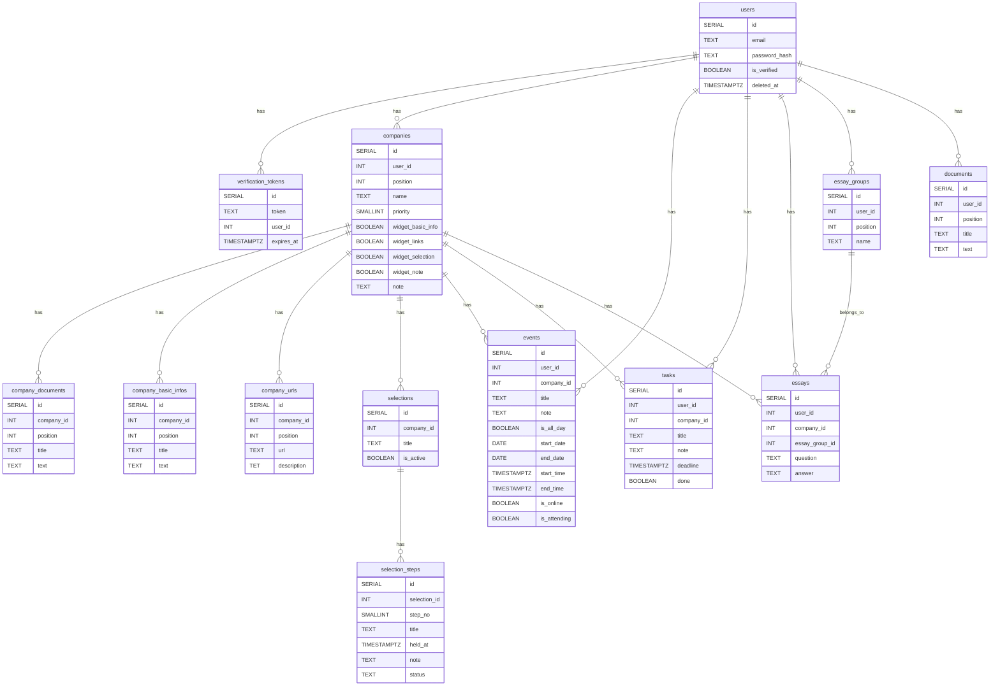

<!-- omit in toc -->
# データベース設計

<!-- omit in toc -->
### テーブル一覧

- [users](#users)
- [verification\_tokens](#verification_tokens)
- [companies](#companies)
- [company\_documents](#company_documents)
- [company\_basic\_infos](#company_basic_infos)
- [company\_urls](#company_urls)
- [selections](#selections)
- [selection\_steps](#selection_steps)
- [events](#events)
- [tasks](#tasks)
- [essays](#essays)
- [essay\_groups](#essay_groups)
- [documents](#documents)

```mermaid
erDiagram
  users ||--o{ verification_tokens : has
  users ||--o{ companies : has
  users ||--o{ events : has
  users ||--o{ tasks : has
  users ||--o{ essays : has
  users ||--o{ essay_groups : has
  users ||--o{ documents : has
  companies ||--o{ company_documents : has
  companies ||--o{ company_basic_infos : has
  companies ||--o{ company_urls : has
  companies ||--o{ selections : has
  selections ||--o{ selection_steps : has
  companies ||--o{ events : has
  companies ||--o{ tasks : has
  companies ||--o{ essays : has
  essay_groups ||--o{ essays : belongs_to

  users {
    SERIAL id
    TEXT email
    TEXT password_hash
    BOOLEAN is_verified
    TIMESTAMPTZ deleted_at
  }

  verification_tokens {
    SERIAL id
    TEXT token
    INT user_id
    TIMESTAMPTZ expires_at
  }

  companies {
    SERIAL id
    INT user_id
    INT position
    TEXT name
    SMALLINT priority
    BOOLEAN widget_basic_info
    BOOLEAN widget_links
    BOOLEAN widget_selection
    BOOLEAN widget_note
    TEXT note
  }

  company_documents {
    SERIAL id
    INT company_id
    INT position
    TEXT title
    TEXT text
  }

  company_basic_infos {
    SERIAL id
    INT company_id
    INT position
    TEXT title
    TEXT text
  }

  company_urls {
    SERIAL id
    INT company_id
    INT position
    TEXT url
    TET description
  }

  selections {
    SERIAL id
    INT company_id
    TEXT title
    BOOLEAN is_active
  }

  selection_steps {
    SERIAL id
    INT selection_id
    SMALLINT step_no
    TEXT title
    TIMESTAMPTZ held_at
    TEXT note
    TEXT status
  }

  events {
    SERIAL id
    INT user_id
    INT company_id
    TEXT title
    TEXT note
    BOOLEAN is_all_day
    DATE start_date
    DATE end_date
    TIMESTAMPTZ start_time
    TIMESTAMPTZ end_time
    BOOLEAN is_online
    BOOLEAN is_attending
  }

  tasks {
    SERIAL id
    INT user_id
    INT company_id
    TEXT title
    TEXT note
    TIMESTAMPTZ deadline
    BOOLEAN done
  }

  essays {
    SERIAL id
    INT user_id
    INT company_id
    INT essay_group_id
    TEXT question
    TEXT answer
  }

  essay_groups {
    SERIAL id
    INT user_id
    INT position
    TEXT name
  }

  documents {
    SERIAL id
    INT user_id
    INT position
    TEXT title
    TEXT text
  }
```

## users

ユーザー情報

| column         | type         | NULL | description        |
| -------------- | ------------ | ---- | ------------------ |
| id             | SERIAL       | NO   | ユーザーID         |
| email          | TEXT         | NO   | メールアドレス     |
| password_hash  | TEXT         | NO   | パスワードのハッシュ値 |
| is_verified    | BOOLEAN      | NO   | メールアドレス認証の可否 |
| deleted_at     | TIMESTAMPTZ  | YES  | アカウント削除日時 |

- is_verified
  - DEFAULT FALSE
  - TRUEの場合のみログイン可能
  - メールアドレス認証を完了するとTRUEになる
- deleted_at
  - NULLでない場合は論理削除扱い

<!-- omit in toc -->
#### 制約

- UNIQUE
  - email
- INDEX
  - id

## verification_tokens

メールアドレスの認証トークン

| column         | type         | NULL | description        |
| -------------- | ------------ | ---- | ------------------ |
| id             | SERIAL       | NO   | ID                 |
| user_id        | INT          | NO   | ユーザーID         |
| token          | TEXT         | NO   | トークン           |
| expires_at     | TIMESTAMPTZ    | NO   | 有効期限           |

- expires_at
  - トークンの有効期限

<!-- omit in toc -->
#### 制約

- FOREIGN
  - user_id: users.id(ON DELETE CASCADE)
- UNIQUE
  - token
- INDEX
  - user_id

## companies

企業情報

| column         | type         | NULL | description        |
| -------------- | ------------ | ---- | ------------------ |
| id             | SERIAL       | NO   | 企業ID             |
| user_id        | INT          | NO   | ユーザーID         |
| position       | INT          | NO   | 表示順             |
| name           | TEXT         | NO   | 企業名             |
| priority       | SMALLINT     | NO   | 志望度             |
| widget_basic_info | BOOLEAN   | NO   | 基本情報ウィジェットの表示／非表示 |
| widget_links   | BOOLEAN      | NO   | 関連リンクウィジェットの表示／非表示 |
| widget_selection | BOOLEAN    | NO   | 選考状況ウィジェットの表示／非表示 |
| widget_note    | BOOLEAN      | NO   | メモウィジェットの表示／非表示 |
| note           | TEXT         | YES  | 付箋メモ           |

- priority
  - BETWEEN 0 AND 6
  - 0: 未分類, 1-5: 第n志望, 6: アーカイブ
- widget_*
  - trueならばウィジェットを表示する
  - DEFAULT FALSE
  - 参照：実装時にはトランザクションを利用

<!-- omit in toc -->
#### 制約

- FOREIGN
  - user_id: users.id(ON DELETE CASCADE)
- UNIQUE
  - id, user_id
  - user_id, name
  - user_id, priority, position
- INDEX
  - user_id

## company_documents

企業に関する文章(Markdown)

| column         | type         | NULL | description        |
| -------------- | ------------ | ---- | ------------------ |
| id             | SERIAL       | NO   | 企業関連文書ID     |
| company_id     | INT          | NO   | 企業ID             |
| position       | INT          | NO   | 表示順             |
| title          | TEXT         | NO   | タイトル           |
| text           | TEXT         | NO   | 本文               |

<!-- omit in toc -->
#### 制約

- FOREIGN
  - company_id: companies.id(ON DELETE CASCADE)
- UNIQUE
  - company_id, position
- INDEX
  - company_id

## company_basic_infos

企業の基本情報

| column         | type         | NULL | description        |
| -------------- | ------------ | ---- | ------------------ |
| id             | SERIAL       | NO   | 基本情報ID         |
| company_id     | INT          | NO   | 企業ID             |
| position       | INT          | NO   | 表示順             |
| title          | TEXT         | NO   | 項目名             |
| text           | TEXT         | NO   | 内容               |

<!-- omit in toc -->
#### 制約

- FOREIGN
  - company_id: companies.id(ON DELETE CASCADE)
- UNIQUE
  - company_id, position
- INDEX
  - company_id

## company_urls

企業の関連リンク

| column         | type         | NULL | description        |
| -------------- | ------------ | ---- | ------------------ |
| id             | SERIAL       | NO   | リンクID           |
| company_id     | INT          | NO   | 企業ID             |
| position       | INT          | NO   | 表示順             |
| url            | TEXT         | NO   | リンク             |
| description    | TEXT         | NO   | 説明               |

<!-- omit in toc -->
#### 制約

- FOREIGN
  - company_id: companies.id(ON DELETE CASCADE)
- UNIQUE
  - company_id, position
- INDEX
  - company_id

## selections

選考情報

| column         | type         | NULL | description        |
| -------------- | ------------ | ---- | ------------------ |
| id             | SERIAL       | NO   | 選考ID             |
| company_id     | INT          | NO   | 企業ID             |
| title          | TEXT         | NO   | 選考種別(本選考、インターンなど) |
| is_active      | BOOLEAN      | NO   | trueならば進行中の選考 |

- is_active
  - DEFAULT FALSE

<!-- omit in toc -->
#### 制約

- FOREIGN
  - company_id: companies.id(ON DELETE CASCADE)
- UNIQUE
  - selections(company_id) WHERE is_active = TRUE

## selection_steps

選考ステップ情報

| column         | type         | NULL | description        |
| -------------- | ------------ | ---- | ------------------ |
| id             | SERIAL       | NO   | 選考ステップID     |
| selection_id   | INT          | NO   | 選考ID             |
| step_no        | SMALLINT     | NO   | 選考ステップの順序 |
| title          | TEXT         | NO   | 選考ステップ名(一次面接、書類選考など)|
| held_at        | TIMESTAMPTZ  | YES  | 開催日時           |
| note           | TEXT         | YES  | 詳細情報メモ       |
| status         | TEXT         | NO   | 選考状況           |

- status
  - not_started(未受験) | pending(結果待ち) | passed(合格) | failed(不合格)

<!-- omit in toc -->
#### 制約

- FOREIGN
  - selection_id: selections.id(ON DELETE CASCADE)
- UNIQUE
  - selection_id, step_no
- INDEX
  - selection_id

## events

説明会等のイベント情報

| column         | type         | NULL | description        |
| -------------- | ------------ | ---- | ------------------ |
| id             | SERIAL       | NO   | イベントID         |
| user_id        | INT          | NO   | ユーザーID         |
| company_id     | INT          | YES  | 企業ID             |
| category       | TEXT         | NO   | イベントの種類     |
| title          | TEXT         | NO   | イベント名         |
| note           | TEXT         | YES  | 詳細情報メモ       |
| is_all_day     | BOOLEAN      | NO   | trueならば終日予定 |
| start_date     | DATE         | YES  | 開始日(終日予定)   |
| end_date       | DATE         | YES  | 終了日(終日予定)   |
| start_time     | TIMESTAMPTZ  | YES  | 開始日時           |
| end_time       | TIMESTAMPTZ  | YES  | 終了日時           |
| is_online      | BOOLEAN      | NO   | オンライン／オフライン開催 |
| is_attending   | BOOLEAN      | YES  | 参加／不参加       |

- category
  - session(説明会) | chat(カジュアル面談) | interview(面接) | internship(インターン) | other(その他)
- is_all_day
  - trueならばstart_date, end_dateを使用
  - falseならばstart_time, end_timeを使用
- is_online
  - DEFAULT TRUE
- is_attending
  - typeがsession(説明会)、internship(インターン)、other(その他)の場合のみ使用
  - DEFAULT TRUE

<!-- omit in toc -->
#### 制約

- FOREIGN
  - user_id: users.id(ON DELETE CASCADE)
  - company_id, user_id: companies(id, user_id)(ON DELETE CASCADE)
- CHECK
  - end_date >= start_date
  - end_time > start_time
- INDEX
  - user_id
  - company_id, user_id

## tasks

タスクリスト

| column         | type         | NULL | description        |
| -------------- | ------------ | ---- | ------------------ |
| id             | SERIAL       | NO   | タスクID           |
| user_id        | INT          | NO   | ユーザーID         |
| company_id     | INT          | YES  | 企業ID             |
| title          | TEXT         | NO   | タスク概要         |
| note           | TEXT         | YES  | タスク詳細         |
| deadline       | TIMESTAMPTZ  | YES  | 期限               |
| done           | BOOLEAN      | NO   | 完了／未完了       |

<!-- omit in toc -->
#### 制約

- FOREIGN
  - user_id: users.id(ON DELETE CASCADE)
  - company_id, user_id: companies(id, user_id)(ON DELETE CASCADE)
- INDEX
  - user_id
  - user_id, deadline
  - company_id, user_id

## essays

エントリーシート回答集

| column            | type         | NULL | description        |
| ----------------- | ------------ | ---- | ------------------ |
| id                | SERIAL       | NO   | エントリーシートID |
| user_id           | INT          | NO   | ユーザーID         |
| company_id        | INT          | YES  | 企業ID             |
| essay_group_id    | INT          | NO   | 設問グループID     |
| question          | TEXT         | NO   | 設問               |
| answer            | TEXT         | NO   | 回答               |

<!-- omit in toc -->
#### 制約

- FOREIGN
  - user_id: users.id(ON DELETE CASCADE)
  - company_id, user_id: companies(id, user_id)(ON DELETE CASCADE)
  - essay_group_id, user_id: essay_groups(id, user_id)(ON DELETE RESTRICT)
- INDEX
  - user_id
  - company_id, user_id
  - essay_group_id, user_id

## essay_groups

エントリーシートの設問種別のグループ分け

| column            | type         | NULL | description        |
| ----------------- | ------------ | ---- | ------------------ |
| id                | SERIAL       | NO   | 設問グループID     |
| user_id           | INT          | NO   | ユーザーID         |
| position          | INT          | NO   | 表示順             |
| name              | TEXT         | NO   | グループ名         |

<!-- omit in toc -->
#### 制約

- FOREIGN
  - user_id: users.id(ON DELETE CASCADE)
- UNIQUE
  - id, user_id
  - user_id, name
  - user_id, position

## documents

| column            | type         | NULL | description        |
| ----------------- | ------------ | ---- | ------------------ |
| id                | SERIAL       | NO   | 文書ID             |
| user_id           | INT          | NO   | ユーザーID         |
| position          | INT          | NO   | 表示順             |
| title             | TEXT         | NO   | タイトル           |
| text              | TEXT         | NO   | 本文               |

<!-- omit in toc -->
#### 制約

- FOREIGN
  - user_id: users.id(ON DELETE CASCADE)
- UNIQUE
  - user_id, position
- INDEX
  - user_id
